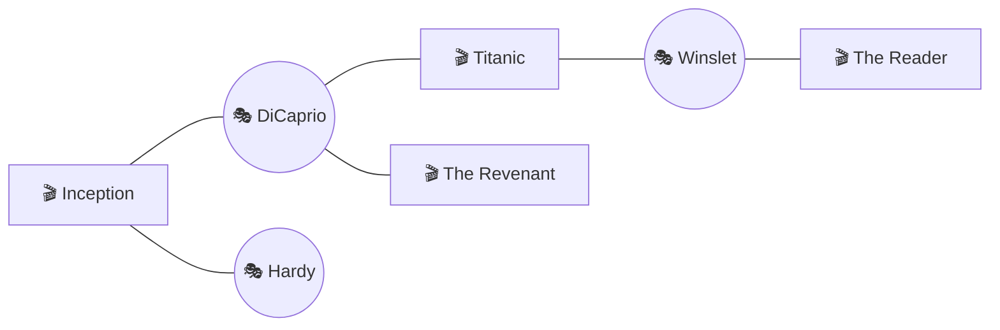
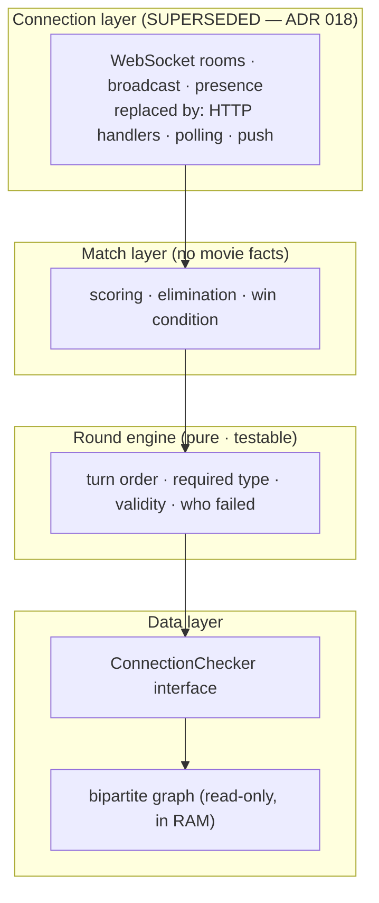

# Designing the Movie-Actor Chain Game

### A system-design case study in finding the real constraint

> **How to read this.** This is a retrospective of two design sessions on a small hobby project. It is deliberately _not_ a build spec. The value is in the reasoning — the reframings, the options weighed, and the tradeoffs taken — so each section is structured as **problem → options → tradeoff → takeaway**. A final section abstracts the lessons into principles you can carry to unrelated projects. Where the text extends beyond what the sessions actually covered, it says so.

> ⚠️ **Superseded in part — read this before §2, §5, or §6.** This document's central claim is that the
> system is **connection-bound**, and it reasons from there to a WebSocket transport, a cost model
> built on connection-holding and broadcast egress, and a language comparison decided by concurrency
> model. **[ADR 018](../DECISIONS.md) overturned that premise.** The game is turn-based and rewards recall
> rather than reaction time; "real-time" is a time-control setting, not an architecture. Moves go over
> ordinary request/response, opponents learn of them by polling plus push, and there are no sockets,
> no presence service, no broadcast channel, and no single-instance constraint.
>
> The affected text is **kept unedited as dated record** — the wrong turn is part of the reasoning
> trail, and §7's lesson about finding the real constraint applies to this document as much as to the
> connection check it was written about. Superseding markers appear inline at each affected point.
> **Do not build from §2's constraint claim, §5's cost model, or §6's evaluation criteria**, and in
> particular do not let §6 select a stack: it scores runtimes on idle-socket memory and broadcast
> fan-out, neither of which this system has.

---

## 1. Context: a small game with a sharp design problem

The project is a turn-based word game. Players alternate naming a **movie** or an **actor**, and every answer must connect factually to the previous one: name an actor who was in the previous movie, or a movie the previous actor was in. The chain runs until someone can't extend it.

```
Inception (movie)
  → Leonardo DiCaprio   (actor — was in Inception)
    → Titanic           (movie — DiCaprio was in it)
      → Kate Winslet     (actor — was in Titanic)
        → The Reader      (movie — Winslet was in it)
```

The constraints are what make it interesting. The intent is **non-commercial and hobby-scale**, but with two non-negotiables: it should be _extensible_ enough to survive growth, and it should never be _forced_ to limit the game by operational cost. "Build something cheap" and "build something that can scale" usually pull against each other; reconciling them was the spine of the whole exercise.

What makes this a good teaching case is that the game's rules make the design questions unusually _sharp_. There's exactly one hard problem in the rules — establishing whether an actor was really in a movie — and a single architectural property (the game is real-time and turn-based) **[SUPERSEDED — ADR 018: that is two properties, and only "turn-based" is a rule; "real-time" is a time control]** that, once you take it seriously, sorts almost every downstream decision for you. Most of this document is the consequence of taking those two things seriously.

> **Superseded ([ADR 018](../DECISIONS.md)).** "The game is real-time and turn-based" is written here as one property. It is two, and only one is a rule. **Turn-based is a rule of the game; real-time is a time-control setting** — the way blitz is a setting in chess, not a different architecture. Fusing them is the error this document then builds on for three sections. Read the rest of the sentence as still true of the _turn-based_ half: it really does sort the downstream decisions, just toward a much duller architecture than the one below.

---

## 2. The reframing that organized everything [precompute holds · "connection-bound" SUPERSEDED — ADR 018]

**The intuitive trap.** Read the rules and the expensive-looking part jumps out immediately: the _connection check_. "Did this actor appear in this movie" feels like the thing you'll spend your effort on — it requires ground truth, it's fuzzy at the edges, it's where correctness lives. The natural instinct is to optimize it.

**The inversion.** That instinct is backwards. Once you precompute the relationship between actors and movies, the per-turn check collapses to a single hash lookup — _is this actor in this movie's cast set?_ — which is sub-millisecond and needs no external call. The check isn't the bottleneck. It's the cheapest thing in the system.

The real constraint moves somewhere far less obvious: **managing many long-lived, mostly-idle WebSocket connections** for synchronous real-time play. **[SUPERSEDED — ADR 018. This is the origin of the document's central error: "mostly-idle" was the tell that the transport was wrong, not that idle connections needed engineering around. There are no WebSockets in this project.]** A realistic per-turn latency budget makes the point:

| Step                                        | Cost        |
| ------------------------------------------- | ----------- |
| Type check (is it the required type?)       | < 1 ms      |
| Connection check (in-memory set membership) | < 1 ms      |
| State update + broadcast to the room        | ~5–10 ms    |
| Typeahead search (separate, per keystroke)  | < 50 ms p99 |

Server-side turn processing sits comfortably under ~50 ms and is dominated by network round-trips to clients, not computation. The app is **connection-bound and I/O-bound, not compute-bound.** **[SUPERSEDED — ADR 018: there are no persistent connections; moves go over request/response and the app is neither connection-bound nor compute-bound.]**

This single sentence is the throughline of the entire project. Every section below is, in some sense, a corollary of it. It's also the first transferable lesson: _the part of a system that looks hardest in the spec is often not the part that decides the architecture._ Find the real constraint before you optimize the obvious one.

> **Superseded ([ADR 018](../DECISIONS.md)) — and note the tell.** The paragraph above names the constraint as many long-lived, **mostly-idle** connections. That adjective is the counter-argument: a persistent bidirectional connection carrying a few messages per minute is a mechanism without a workload. The right conclusion was that the transport was wrong, not that idle connections were a thing to engineer around.
>
> What actually follows from a turn-based game with a seconds-scale latency budget: **request/response for moves, polling plus push for notification.** The app is neither connection-bound nor compute-bound; at the scale this project will ever see, it is not bound by anything, which is the honest answer.
>
> Two further points settle it. **Real-time degrades as player count grows** — with four players on a 60-second clock, each waits ~3 minutes between turns and all four must be simultaneously present — while correspondence is indifferent to N, and N > 2 is a day-one requirement ([ADR 015](../DECISIONS.md)). And the row this table under-weights is the last one: **the typeahead is the highest-frequency operation in the system by a wide margin**, far above move submission. §2 correctly identifies name resolution as the real hard problem a few pages on, then spends the architecture budget on transport anyway.
>
> The lesson in the paragraph above is sound. This document is just a second instance of it.

> One caveat worth stating early, because it constrains a later decision: the "sub-millisecond validation" property holds _only_ while the precomputed graph lives in the same process's memory as the validation logic. That co-location is load-bearing, and it quietly rules out some otherwise-tidy deployment shapes (see §6).

> **Superseded by [ADR 026](../DECISIONS.md).** The caveat is technically correct and was acted on for
> two months; what it got wrong was calling co-location load-bearing. Sub-millisecond validation was
> never a requirement — a turn takes minutes to days — so the property it protects is not one this
> game needs. The graph now lives in Postgres with game state. Note that §3's own table names the seam
> that made the swap cheap: *"hide validation behind a `ConnectionChecker` interface — lets you swap
> the backing store (in-process map → an external store → something else) without touching game
> logic."* That advice held, and it is the reason this correction cost a loader rather than a rewrite.

---

## 3. Validation and the graph

**Problem.** Establish ground truth for "did this actor appear in this movie," fast enough to sit in the hot path of every turn.

**Options weighed.**

- **Live external movie API per turn** (e.g. a TMDB/OMDb call on each answer). Fine for an MVP demo, but you inherit 100–500 ms latency, third-party rate limits, and a hard dependency sitting directly in your request path. It does not survive growth.
- **A precomputed bipartite graph.** Build the actor↔movie relationship once, offline, and hold it in memory. The per-turn check becomes an O(1) lookup. This is the choice everything else hangs on.
- **LLM judgment as the primary validator.** 500 ms–2 s per call, real per-call cost, and nondeterministic. Wrong for the hot path — but a reasonable _fallback_ for genuinely fuzzy disputes (cameos, voice roles), not the main check.

**The graph.** Structurally the game is a walk along a bipartite graph: two node sets (actors, movies) with an edge wherever an actor appeared in a movie. A round alternates node sets each step; a player fails when they can't extend the walk. The representation that matters is just two adjacency maps:

```
movie_id  →  set(actor_ids)
actor_id  →  set(movie_ids)
```



The connection check is then `actor_id in movie_to_actors[movie_id]` — one lookup, no traversal. You only need real graph algorithms (BFS, shortest path) if you later add features like "is this chain still solvable from here" hints, which is an extension, not core.

Sizing is reassuring. A _curated_ catalog of ~50–100k popular movies (rather than the full 1M+ title universe) yields roughly 1.5–2.5M edges, which is a few hundred MB of adjacency data — comfortably in RAM on a single modest node. Crucially, **the graph is a fixed cost that does not grow with user count.** It's built offline by a versioned batch ETL job and loaded read-only at boot — never touched in the request path.

_The estimate above was made before the pipeline existed. The first real build came in well under it: 47,624 movies, 89,074 actors, 456,129 edges, 21MB on disk — a curated catalog is smaller than projected, and the in-memory assumption is no longer an assumption._

**Name resolution is the _actual_ hard real-time problem.** Connection-checking is easy once precomputed; the genuinely fuzzy part is resolving "DiCaprio" or a typo to a canonical entity ID, and disambiguating two movies that share a title. The cleanest fix is a UX decision, not a backend one: make input a **typeahead that resolves to a canonical entity ID before submission.** The player picks from search results; the server receives `{type, id}`, never free text. That single choice (a) makes the connection check fully deterministic, (b) eliminates same-title disambiguation, and (c) removes most of the need for a dispute/challenge system in v1. The alternative — accepting free text — drags you into fuzzy matching plus an inevitable challenge mechanism. That's real scope; defer it.

**Cast-depth capping: one lever, three jobs.** A film's full credits run to hundreds of bit-part and uncredited people. Cap each movie to its top-N billed cast (say N = 10–20). This is simultaneously:

1. a **gameplay knob** — smaller N makes the game harder, because fewer obscure actors are available to bridge films;
2. a **policy lever** — it's where you implement the rules' open question of what "appeared in" even means; and
3. a **scale lever** — it directly bounds edge count and graph size.

Without the cap, the game becomes trivially easy and weird (every movie connects to everything through some background extra) _and_ your graph explodes. One decision, three problems solved.

**Four lock-ins: cheap now, expensive to retrofit.** These cost almost nothing to honor at the start and are painful to introduce later:

| Decision                                                                                                                                                                               | Why it's load-bearing                                                                                                                        |
| -------------------------------------------------------------------------------------------------------------------------------------------------------------------------------------- | -------------------------------------------------------------------------------------------------------------------------------------------- |
| Validate on **entity IDs, not strings**                                                                                                                                                | Keeps the check deterministic and makes the typeahead contract clean.                                                                        |
| **Two-layer split**: a pure _round engine_ (turn order, required type, validity, who failed — no scoring) under a _match layer_ (scoring, elimination, win condition — no movie facts) | Each layer is independently testable and replaceable. The engine knows nothing about points; the match layer knows nothing about cast lists. |
| Hide validation behind a **`ConnectionChecker` interface**                                                                                                                             | Lets you swap the backing store (in-process map → an external store → something else) without touching game logic.                          |
| Keep authoritative game state **serializable**                                                                                                                                         | A single in-memory node can later become a store-backed multi-node deployment without a rewrite.                                             |

Laid out as layers:

> **Superseded ([ADR 018](../DECISIONS.md)).** The top layer of the diagram below is now
> `HTTP handlers · polling · push` — there are no WebSocket rooms, no broadcast, and no presence. It is
> also no longer "the scaling axis": with nothing held per connection, scaling is unremarkable. The
> three layers beneath it are unchanged and still correct.



**Takeaway.** The hard-looking domain problem (the connection check) was dissolved by moving work _offline_ (precompute) and by moving fuzziness _to the boundary_ (typeahead-to-IDs). What's left in the hot path is deterministic and trivial — which is exactly what lets the system scale on a different axis entirely.

---

## 4. Data and licensing

**Problem.** Where does the actor↔movie data come from, and what obligations does using that source impose — especially for a project that might someday accept donations?

**The distinction that resolves it: copyright vs. contract.** These are two separate questions, and conflating them is the common mistake.

- _Copyright question — does anyone own the fact that "Actor X was in Movie Y"?_ No. Under **Feist**, facts are not copyrightable; only a creative arrangement of them can be. So the underlying relationships are free.
- _Contract question — did you agree to terms in order to obtain those facts?_ Possibly yes. If you pulled the data by using a provider's API or service, you're bound by that provider's terms **regardless of whether you kept their formatting.** The obligation attaches to _how you got it_, not to _what it looks like_ afterward.

The practical consequence: **provenance, not formatting, is what binds you.** And provenance leaves fingerprints — storing a provider's IDs (e.g. TMDB IDs) in your database is essentially a signature of where the data came from.

**The sources, compared.**

| Source                           | License posture                                                                                                                                                           | Fit                                                                                                                                                                                                                                          |
| -------------------------------- | ------------------------------------------------------------------------------------------------------------------------------------------------------------------------- | -------------------------------------------------------------------------------------------------------------------------------------------------------------------------------------------------------------------------------------------- |
| **TMDB** (API)                   | Free for non-commercial use _with attribution_; a paid agreement is required for commercial use, and "commercial" is defined broadly. Terms also include an AI/ML clause. | Fine for a purely non-commercial, no-AI MVP. Two traps: it counts essentially _any_ revenue — including ads and arguably donation-funded operation — as commercial, and its AI/ML clause conflicts with using an LLM for dispute resolution. |
| **IMDb** non-commercial datasets | Downloadable, but strictly non-commercial.                                                                                                                                | Usable as a data download, but a dead end the moment money enters the picture.                                                                                                                                                               |
| **Wikidata**                     | CC0 — public domain dedication. No attribution requirement, no AI restriction.                                                                                            | The cleanest option for any scenario involving revenue, AI components, or donation funding. Use Wikidata QIDs as your canonical keys.                                                                                                        |

**The interaction with funding.** This is the subtle bit that ties §4 to §5. Because the no-profit goal points toward _eventually accepting donations_ to cover costs, and because TMDB's terms plausibly treat donation-funded operation as commercial use, **building on CC0 Wikidata data from the start removes a question you'd otherwise have to keep re-asking.** Clean provenance isn't just legal hygiene — it's what keeps the "fund my costs without profiting" door open with no asterisk.

> Not legal advice — for any monetized use, the actual terms should be verified directly. The point here is the _reasoning structure_: separate "who owns the fact" from "what did you agree to in order to get it."

**Takeaway.** When a resource is "free," the binding constraint is rarely copyright — it's the contract you accepted to access it. Choosing the most permissive _source_ up front (CC0) is cheaper than auditing a restrictive one's terms forever, and it preserves future options you haven't committed to yet.

---

## 5. [SUPERSEDED — ADR 018] Cost and funding

> ⚠️ **Superseded ([ADR 018](../DECISIONS.md)).** This entire section is downstream of the WebSocket
> assumption: it identifies the cost drivers as connection-holding and broadcast egress, then reasons
> about egress pricing, idle-connection reaping, and a Cloudflare-front posture. **None of those
> drivers exist without sockets.** A correspondence game delivering via polling and push has near-zero
> idle cost and negligible egress at any plausible scale — the cost question this section works so hard
> on simply does not arise.
>
> Kept as dated record. The two reusable ideas survive the premise: **concurrency ≠ total users**, and
> **egress pricing varies ~100× and is a provider choice rather than a code change.** Both are true and
> worth carrying elsewhere; neither is a live constraint for this project.

**Problem.** Run a real-time app that must never get throttled by cost _and_ must never produce a surprise bill — on a hobbyist budget.

**Where the bill actually comes from.** Consistent with §2, the cost drivers are not compute or storage. They are **holding open WebSocket connections** and **broadcast egress bandwidth**. **[SUPERSEDED — ADR 018: neither driver exists. There are no sockets and no broadcast; a polling + push correspondence game has near-zero idle cost.]** Two clarifications shaped the model:

- **Concurrency ≠ total users.** A million registered users might be only 10–30k _concurrent_ at peak. You provision for concurrency, not headcount.
- **Viral traffic is spiky, not sustained.** You pay for peak windows, then load decays. This makes autoscale-down and idle-connection reaping (cheap and natural in a turn-based game, where connections sit idle between turns) genuine cost levers rather than micro-optimizations.

**The dominant lever: egress pricing varies ~100×.** This is the single biggest cost decision, and it's a provider choice, not a code change.

| Provider posture                                | Egress (~/GB)      | Effect                                                   |
| ----------------------------------------------- | ------------------ | -------------------------------------------------------- |
| Hyperscaler (AWS/GCP)                           | ~$0.09–0.12        | A broadcast-heavy app racks up thousands/month at scale. |
| Cloudflare / R2, Hetzner, OVH, Oracle free tier | ~free to near-free | The same workload costs a few hundred/month — or less.   |

A lean stack — **Cloudflare in front (free egress, DDoS shielding) of a Hetzner/OVH/Fly origin** — keeps even ~100k concurrent users to a few hundred dollars a month, against thousands on a hyperscaler. _Same workload, ~10× the bill, decided entirely by provider choice._

**The funding ladder (for a no-profit goal).** Each rung is tried before the next:

1. **Engineer the cost down first** — provider arbitrage, idle-connection reaping, autoscale-down off-peak. Most of the problem disappears here.
2. **Lean on free tiers** — e.g. Oracle's always-free VMs and large free egress allowance, Cloudflare's free plan.
3. **Voluntary donations** — Open Collective / GitHub Sponsors. Reimbursing your own infrastructure costs isn't profit, which keeps the spirit (and, per §4, the licensing) intact.
4. **Cost ceilings with graceful degradation as insurance** — when traffic exceeds budget, _queue or waitlist_ new players rather than crashing or accruing a runaway bill. This turns any hard limit into a temporary, graceful queue instead of a failure or a surprise invoice — and it's a feature you design once.

> **[Extends beyond the sessions]** We flagged but did not fully design the graceful-degradation mechanism. Conceptually it belongs at the _match layer / connection-admission_ boundary: the connection layer admits players up to a configured concurrency cap, and beyond it routes new joiners into a queue surfaced in the UI, while in-progress matches continue untouched. Wiring it in from day one (rather than bolting it on) means the cap is just a number you set, not a rearchitecture.

**Takeaway.** Pick infrastructure by your _dominant cost driver_, not by default familiarity. Here that driver is egress, and recognizing it turns a potentially scary bill into a sub-$100/month hobby on the right stack. The architecture's real job is to ensure that if you ever scale, you _choose_ to — rather than being forced into either a crash or an invoice.

---

## 6. [SUPERSEDED — ADR 018] Runtime and language choice — a framework, not a verdict

> ⚠️ **Superseded ([ADR 018](../DECISIONS.md)) — the most important marker in this document.** This
> section picks its deciding axis from the connection-bound premise: "how does each runtime model
> concurrency for many long-lived, mostly-idle connections?" With that premise gone, **every criterion
> below evaluates a workload this system does not have** — idle-socket memory, green threads vs. event
> loops, built-in presence tracking, broadcast fan-out pressure, turnkey socket management.
>
> This is why the section is dangerous rather than merely stale: it does not just describe an old
> decision, it **silently selects the stack** for anyone who reads it as guidance. The stack decision is
> still open and is a planning-session output. Evaluate it on ordinary request/response criteria —
> ecosystem, typing, team familiarity, deployment simplicity, and how cleanly the language expresses
> the round engine's sealed-union state machine. On those terms a boring stack is fully admissible, and
> the caveats this section raises against several contenders do not apply.
>
> One passage below **survives and is arguably the most load-bearing sentence in the document**: the
> polyglot split is blessed across the *offline/online* seam (the Python ETL) but **not** across the
> engine/data seam, because the O(1) validation property holds only while the graph and the validation
> logic share a process. That constraint is independent of transport and still binding.

This session was explicitly an _academic_ exploration: the goal was to understand what different languages are good at, not to commit to one. So this section deliberately ends without a winner. The framework _is_ the takeaway.

**Why the architecture makes the question sharp.** **[SUPERSEDED — ADR 018: the premise is false, so every criterion in this section evaluates a workload this system does not have. Do not use it to pick a stack.]** Because the app is connection-bound, the deciding axis is narrow and concrete: **how does each runtime model concurrency for many long-lived, mostly-idle connections doing trivial per-message work?** That one property sorts the field more than taste or ecosystem does. Three families:

- **Thread-per-connection (classic OS threads).** ~1 MB stack per connection; readable sequential code, but falls over at a few thousand connections. The model you're trying _not_ to use.
- **Event loop / async-await** (Node, Python `asyncio`, Rust `tokio`, C# `async`). One or a few threads multiplex thousands of connections as state machines. Memory-efficient for idle sockets; the cost is "function coloring" and the risk that one blocking call stalls the loop.
- **Lightweight green threads / processes** (Go goroutines ~2 KB, BEAM processes ~300 bytes, JVM virtual threads). Write blocking-_looking_ sequential code that the runtime cheaply parks. Readability of threads, scalability of the event loop — the sweet spot for this workload.

**The contenders, honestly.** **[SUPERSEDED — ADR 018: every "genuine strength here" below is scored against socket concurrency, which this system does not do. The rows remain accurate about the languages in general; they are not reasons to pick one for this project.]**

| Runtime                                   | Genuine strength here                                                                                                                                                                                                                         | Cost                                                                                                                               |
| ----------------------------------------- | --------------------------------------------------------------------------------------------------------------------------------------------------------------------------------------------------------------------------------------------- | ---------------------------------------------------------------------------------------------------------------------------------- |
| **Elixir / BEAM**                         | Almost suspiciously good fit: each match is a lightweight supervised process holding its own state (maps 1:1 onto the per-match model); presence/connection tracking is built in; the "serializable state, single→multi-node" goal is native. | Slow raw per-core compute (irrelevant here), smaller hiring pool, functional learning curve.                                       |
| **Go**                                    | The pragmatic default for connection-heavy servers: cheap goroutines, mainstream readable code, single-binary deploy that serves the provider-arbitrage goal directly.                                                                        | Thin type system — modeling `Movie \| Actor` sum types and the turn state machine is clumsier; you lean on discipline.             |
| **Rust**                                  | Lowest memory per connection, no GC pauses (most connections per dollar of RAM); enums + exhaustive `match` are _perfect_ for the pure round engine.                                                                                          | Development velocity — borrow checker and async Rust are real friction on a hobby project, and you're not compute-bound anyway.    |
| **JVM (Kotlin / Java + virtual threads)** | Loom gives cheap green-threaded concurrency with a huge ecosystem and great profiling; Kotlin's sealed classes model the engine well.                                                                                                         | Heavier memory/ops baseline than Go/Rust.                                                                                          |
| **Node / TypeScript**                     | One language full-stack: shared types between the typeahead client and server validation; discriminated unions model the entities cleanly.                                                                                                    | Single-threaded per process (scale via N processes + sticky sessions or an external pub-sub); broadcast fan-out pressures the event loop. |
| **C# / .NET**                             | Underrated: SignalR makes WebSocket management, reconnection, and a scale-out backplane nearly turnkey.                                                                                                                                         | Smaller indie/hobby mindshare — cultural more than technical.                                                                      |
| **Python**                                | Weakest fit for the _connection layer_ (GIL + interpreter overhead) — but arguably the _best_ choice for the offline ETL / graph build, whatever runs the server.                                                                             | —                                                                                                                                  |

**The split worth noticing: the engine and the connection layer are different jobs.** The **pure round engine** (`Movie | Actor` sum type, alternating-type state machine, both-checks-must-pass validation) is textbook algebraic-data-type territory — languages with sum types and exhaustive pattern matching let the _compiler_ prove every turn state is handled, which is exactly the guarantee you want from a layer you called "pure and testable." The **connection layer** wants the concurrency strengths above. The **ETL** wants data-wrangling ergonomics. These don't have to be the same language.

So a defensible _polyglot_ answer exists — Python for the offline graph build, a green-threaded runtime for the live server, the engine written in whatever gives the best type guarantees within it.

**But §2's caveat constrains the polyglot shape.** The tempting version — a Go connection container talking over the network to a separate Kotlin engine container — quietly breaks the property the whole design rests on. The connection check is O(1) _only because the graph sits in the same process's RAM._ Split the engine onto the far side of a network hop from the graph and you've reintroduced latency into the hot path you worked to eliminate. **The graph is the gravitational center; the validation logic wants to live next to it.** A clean polyglot split is fine across the _offline/online_ seam (ETL vs. server); it's dangerous across the _engine/data_ seam.

**Takeaway.** When a system has one dominant architectural property, it converts a sprawling "which language?" debate into a small number of sharp, answerable questions. The right output of that analysis isn't always a single choice — sometimes it's a _framework_ plus a hard constraint (here: co-locate validation with the graph) that any future choice has to respect.

---

## 7. Transferable principles

Abstracted from the project so they travel to unrelated work:

1. **Find the real constraint before you optimize the obvious one.** The spec's scariest component (the connection check) was the cheapest part of the running system. Profile the _shape_ of the work, not your intuition about it.

2. **Move hard work offline, and move fuzziness to the boundary.** Precomputing the graph took validation out of the hot path; the typeahead-to-IDs UX took fuzzy name-matching out of the backend entirely. Both turned a hard runtime problem into a non-problem.

3. **Separate the pure core from the I/O shell.** The round-engine / match-layer / connection-layer split made each piece independently testable and replaceable. Pure logic with no I/O is the part you can actually trust.

4. **Provenance, not formatting, determines your obligations.** "Is this free?" is two questions — who owns the fact (copyright) and what you agreed to in order to get it (contract). Choosing the most permissive _source_ up front is cheaper than auditing a restrictive one forever.

5. **Design the failure mode as a feature.** Graceful degradation — a queue instead of a crash or a surprise bill — converts your worst case into something you _chose_. Decide it on day one; it's nearly impossible to bolt on under load.

6. **Pick infrastructure by your dominant cost driver.** Here it was egress, varying ~100× by provider. Identifying that one variable turned a frightening bill into a rounding error. **[The example is SUPERSEDED — ADR 018; egress was a driver only because of broadcast. The principle survives.]**

   > **Example superseded ([ADR 018](../DECISIONS.md)).** Egress was the dominant driver only because of broadcast over persistent connections. Without them this project has no dominant cost driver worth designing around. The principle is sound; the instance of it was an artifact of the mistake in #7.

7. **Find the one property that makes the hard questions sharp.** "Connection-bound, not compute-bound" collapsed an open-ended tech-stack debate into a single decisive axis. The best architectural insight is usually the one sentence that makes everything else follow. **[The example is SUPERSEDED — ADR 018; that sentence was wrong. The principle survives, inverted — see below.]**

   > **The example inverts; the principle holds — with a warning attached ([ADR 018](../DECISIONS.md)).** That one sentence was *wrong*, and because everything followed from it, the error propagated into the transport, the cost model, and the language evaluation before anyone checked it. The corrected property is duller: **the game is turn-based, and nothing in it is decided by reaction time.** So the real principle is two-sided — a single sharp property does collapse the decision space, and that is exactly why it earns more scrutiny than any decision downstream of it. Load-bearing sentences deserve to be attacked, not admired.
   >
   > The tell was available at the time and written down: §2 described the connections as **mostly idle**. A constraint that is mostly idle is usually not the constraint.

8. **Let the architecture preserve choice.** The lock-ins (IDs not strings, serializable state, the `ConnectionChecker` interface) cost little early and kept later doors open. Good early decisions aren't the ones that solve scale — they're the ones that don't _foreclose_ it.

---

_Source material: two design sessions on this project — one on MVP-to-scale system design (validation, the graph, data licensing, cost, and funding), one on tech-stack and concurrency models. Sections 2–5 reflect decisions taken; section 6 is a framework left intentionally open. Passages marked as extensions go beyond what was discussed._
